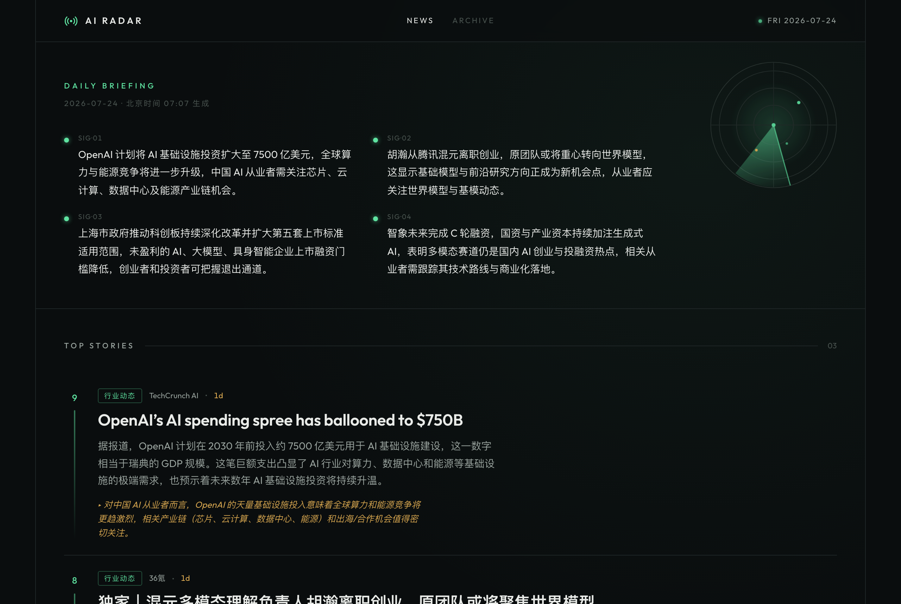
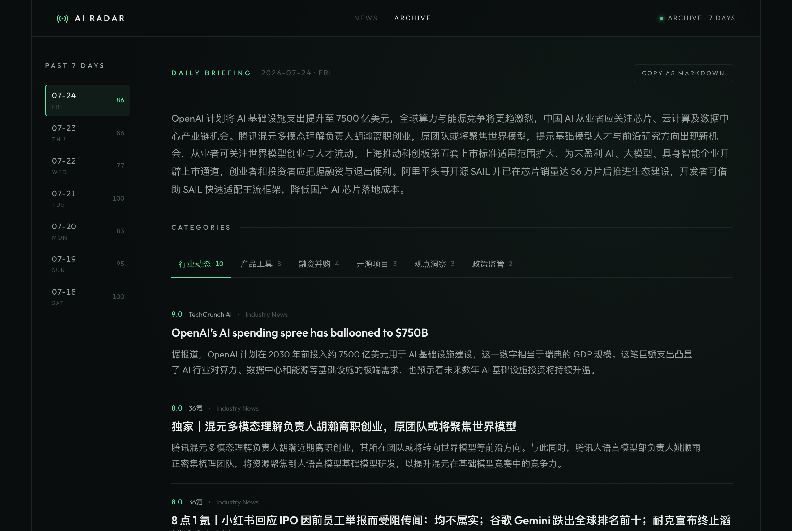
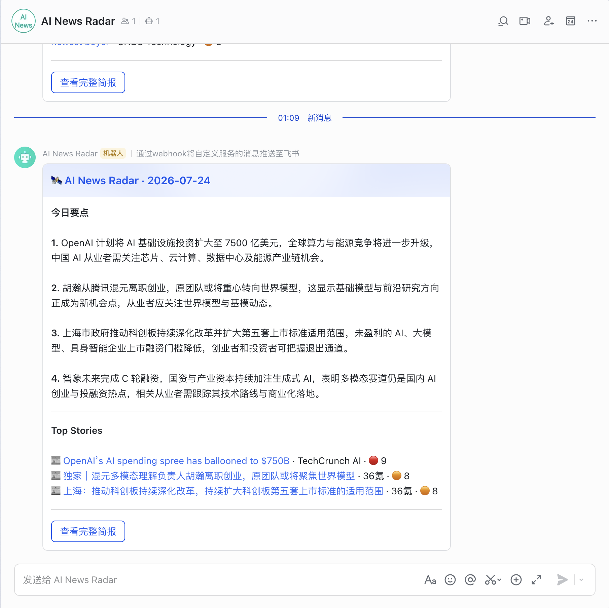

# AI News Radar — 每天 5 分钟读完 AI 圈的一天

> 给需要每天跟进 AI 动态的从业者/求职者的自动化简报，解决「信息散在上百个源里、更新快到刷不完，同一件事还被反复报」的问题。

🔗 线上：[ai-radar-delta.vercel.app](https://ai-radar-delta.vercel.app/) —— [`/digest`](https://ai-radar-delta.vercel.app/digest) 今日简报 · [`/archive`](https://ai-radar-delta.vercel.app/archive) 历史归档

## 为什么做这个

AI 一天一个样：模型发布、产品动态、观点争论散落在官方博客、媒体、Reddit、HN、X 这些完全不同的平台上，数量庞大，而且在一天之内就会迭代翻新——靠人逐个平台刷，既追不完也分不清轻重。通用 RSS 聚合器只做收集，不判断重要性、不去重、更不给中文摘要；同一个模型发布，中英文五六个源各报一遍。所以做了一条全自动流水线：128 个 RSS 源 + AI builder 动态定时爬取 → LLM 逐篇中文摘要、按重要性 1-10 打分、8 类分类 → 跨语言去重合并同一事件 → 每天产出一页 5 分钟能读完的简报，附飞书推送。为了让它无人值守地一直跑下去，大部分工程量花在了「免费 LLM 额度耗尽、模型异常时如何自愈」上。

## 核心功能

- ✅ 128 个 RSS 源自动爬取 —— 官方博客 / 中英媒体 / HN / GitHub & HuggingFace Trending，另有 AI builder 推文与播客独立爬虫（via [follow-builders](https://github.com/zarazhangrui/follow-builders)），不用自己维护 RSS 列表
- ✅ LLM 摘要 + 重要性打分 —— 每篇产出中文摘要、1-10 重要性、8 类分类和"为什么重要"，打开就是排好序的今日要点
- ✅ 跨语言去重 —— 同一事件中英多源只留一条，官方源优先做代表；去重集中在 cron 做一次，页面只读引用
- ✅ 一键 Copy as Markdown —— 归档页整日简报一键复制为 Markdown，可直接粘进微信、Notion、邮件分享
- ✅ 免费模型自愈链 —— 模型池状态落库（探测 / 冷却 / 复活 / 遥测排序），配额耗尽或超时自动切换；免费聊天模型硬白名单挡住付费模型和不能聊天的 SKU 混入
- ✅ 全链路可观测 —— 生成失败或静默跳过都会推飞书红色告警卡，正常日推蓝色简报卡；页面 ISR 静态化，秒开

## 效果展示

**每日简报 `/digest`** —— 今日要点 + Top Stories：



**历史归档 `/archive`** —— 按日期回看，每天 Top 30 + 8 类速览：



**飞书每日推送** —— 今日要点 + Top Stories，一键跳完整简报：



直接看线上：[ai-radar-delta.vercel.app/digest](https://ai-radar-delta.vercel.app/digest)

## 快速开始

```bash
npm install
cp .env.example .env.local   # 按注释填 Supabase + LLM key
npm run dev                  # http://localhost:3000
```

数据侧：在 Supabase 执行 [`supabase/migrations/`](supabase/migrations/)（001–007）建表；`npm run crawl` / `npm run process` / `npm run digest` 可手动跑一轮完整流水线（生产环境由 GitHub Actions cron 驱动）。

| 环境变量 | 必需 | 用途 |
|---|---|---|
| `NEXT_PUBLIC_SUPABASE_URL` / `NEXT_PUBLIC_SUPABASE_ANON_KEY` | 是 | Supabase 项目与公开读 key（RLS 只放行 SELECT） |
| `SUPABASE_SERVICE_ROLE_KEY` | 是 | 流水线写库用（只出现在 Actions secrets） |
| `LLM_API_KEY` / `LLM_BASE_URL` | 是 | LLM 供应商（DashScope OpenAI 兼容端点或 Anthropic） |
| `LLM_MODEL_CHAIN` | 否 | 备用模型链；配合库表实现自愈 |
| `CRON_SECRET` | 是 | 保护 `/api/cron/*` 路由的 bearer token |
| `LARK_WEBHOOK_URL` | 否 | 飞书机器人推送（安全设置：关键词 `Radar`，勿开签名校验） |

## 技术方案（简）

Next.js 15（App Router + ISR）+ Supabase（Postgres/RLS）+ GitHub Actions cron + 飞书 webhook；LLM 走 DashScope 免费模型池（Qwen/DeepSeek 系）或 Anthropic。数据流：crawl（每 6h，多源并发 + 标题哈希去重）→ process（事件接力触发，drain-loop 批处理 LLM 摘要）→ digest（每日一次：筛分 ≥5 的文章、LLM 跨语言去重、生成 top-30/top-8 双摘要、写库 + 推飞书卡）→ 页面按引用读取，ISR 静态化。

## 设计取舍

1. 静态 fallback 链 → 库表驱动的自愈链（`93513575`、`8fd860ba`）：静态链在配额耗尽时每次调用白等 ~30s，20 分钟的 job 被拖死；自愈链自动探测/冷却/复活模型。代价是引入一张状态表，以及"探活了不能聊天的模型"这类新故障面——OCR 模型劫持打分 6 天全绿无告警之后，补了免费聊天模型硬白名单 + prompt 回显守卫（`a81421c5`）。
2. 去重从页面渲染挪到 cron 集中做一次（`6a9bf2c3`）：两个页面渲染的是同一池子的不同切片，每天约 48 次 LLM 去重调用降到 1 次；代价是简报表要存 `top_article_ids` 引用、页面按 ID 取数。
3. 固定批量 → 墙钟预算 drain-loop（`e158e070`）：单篇 LLM 延迟从 8s 漂到 32s 时，固定 `BATCH_SIZE=50` 会让 20 分钟 job 在 60% 处被掐断；改成按剩余时间决定还接不接下一批。

## Roadmap

- [ ] 免费模型白名单按 provider 拆分（现为 DashScope 专用手工清单，新免费模型不会自动入池）
- [ ] 启用 X/Twitter 直连源（3 个源已就位，等 `TWITTER_BEARER_TOKEN`）
- [ ] 死源维护（sources.ts 中 6 个已注释的失效源修复或移除）

## 订阅

网页直接收藏 [`/digest`](https://ai-radar-delta.vercel.app/digest)；飞书群推送：加自定义机器人 → 安全设置关签名校验、关键词填 `Radar` → webhook 填进 `LARK_WEBHOOK_URL`，5 分钟接通。

## License

MIT
